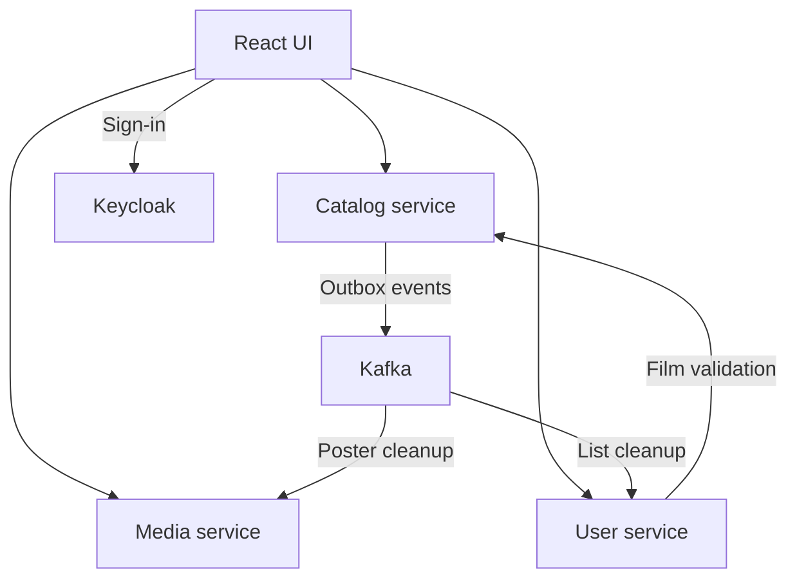

# Filmoteka

Filmoteka is a full-stack movie collection application.

It allows managing a movie database with film details, genres, countries, actors, directors, and poster images, as well as personal film collections.

## Current version

**Filmoteka 2.0.0**

The current development version provides a movie catalog application with:

* film, actor, and director management
* searching, filtering, sorting, and pagination
* poster upload and processing
* PostgreSQL persistence with Flyway migrations
* Docker Compose setup for the complete application
* automated tests and GitHub Actions CI
* OpenAPI documentation, health checks, request logging, and correlation IDs

## Repositories

This repository contains Docker Compose and shared local setup.

Related repositories:

* `filmoteka-catalog` — Java/Spring Boot catalog API
* `filmoteka-media` — Kotlin/Spring Boot media service for poster upload and retrieval
* `filmoteka-user` — Java/Spring Boot user profiles and personal film lists
* `filmoteka-ui` — React/TypeScript frontend
* `filmoteka` — Docker Compose setup

## Architecture



The catalog manages film data.
The media service stores and serves poster images.
The user service manages profiles and personal film lists.
The UI communicates with all three services and uses Keycloak for sign-in.

Catalog and user have separate PostgreSQL databases. Media stores posters in a Docker volume.

Catalog records film-deletion and poster-change events in a database outbox and publishes them to Kafka.
User and media process these events to remove deleted films from lists and delete old posters asynchronously.

## Tech stack

* Java 25
* Kotlin
* Spring Boot
* PostgreSQL
* Flyway
* Kafka
* Keycloak
* React
* TypeScript
* Vite
* React Query
* Axios
* Docker
* Docker Compose
* GitHub Actions

## Features

* Film list and details page
* Create, update, and delete films
* Actors and directors
* Genres and countries
* Poster upload and display
* Separate media service
* Sign-in and role-based access
* User profiles and personal film lists
* Automatic poster and list cleanup through Kafka
* Docker Compose local setup
* Health checks
* Request logging with correlation IDs

## Running with Docker Compose

Clone all five repositories into the same parent directory. Run the following commands from `filmoteka`, using Docker Compose v2 with `--wait` support.

Create a local environment file:

```powershell
Copy-Item .env.example .env
```

Check the Compose configuration:

```powershell
docker compose config --quiet
```

Build and start the infrastructure and application in the background:

```powershell
docker compose up -d --wait catalog-postgres user-postgres keycloak kafka
docker compose up -d --build --wait
```

Rerun the second command after code changes. To build images without starting containers, use `docker compose build`.

Check container status and follow application logs:

```powershell
docker compose ps
docker compose logs -f catalog media user
```

Press `Ctrl+C` to stop following logs; the containers keep running.

Useful URLs:

| Service | URL |
|---|---|
| UI | [http://localhost:5173](http://localhost:5173) |
| Catalog health | [http://localhost:8080/actuator/health](http://localhost:8080/actuator/health) |
| Catalog Swagger UI | [http://localhost:8080/swagger-ui/index.html](http://localhost:8080/swagger-ui/index.html) |
| Media health | [http://localhost:8081/actuator/health](http://localhost:8081/actuator/health) |
| Media Swagger UI | [http://localhost:8081/swagger-ui/index.html](http://localhost:8081/swagger-ui/index.html) |
| User health | [http://localhost:8082/actuator/health](http://localhost:8082/actuator/health) |
| User Swagger UI | [http://localhost:8082/swagger-ui/index.html](http://localhost:8082/swagger-ui/index.html) |
| Keycloak Admin Console | [http://localhost:8180/admin](http://localhost:8180/admin) |

Stop and remove the containers while keeping their stored data:

```powershell
docker compose down
```

Stop and remove volumes, including databases, Keycloak accounts, posters, and Kafka data:

```powershell
docker compose down -v
```

## Local development

Services can also be run separately:

| Application | Address |
|---|---|
| filmoteka-catalog | [http://localhost:8080](http://localhost:8080) |
| filmoteka-media | [http://localhost:8081](http://localhost:8081) |
| filmoteka-user | [http://localhost:8082](http://localhost:8082) |
| filmoteka-ui | [http://localhost:5173](http://localhost:5173) |

Keep PostgreSQL, Keycloak, and Kafka running in Docker. Stop the corresponding application containers before starting services from an IDE. See each repository's README for local configuration.

Frontend:

```powershell
npm install
npm run dev
```

Catalog and user tests, from each repository:

```powershell
.\mvnw.cmd test
```

Media service tests:

```powershell
.\gradlew.bat test
```

Frontend checks:

```powershell
npm run lint
npm run test
npm run build
```

Database integration tests require Docker.

## Environment variables

Example environment variables are provided in:

```text
.env.example
```

The local `.env` file is ignored by Git.

SMTP and Google credentials are placeholders. Configure them to use email verification, password-reset emails, or Google login.

For a local account without email setup, open the Keycloak Admin Console using `KEYCLOAK_ADMIN_USERNAME` and `KEYCLOAK_ADMIN_PASSWORD` from `.env`. Create a user in the `filmoteka` realm with a username, email, first name, and last name. Enable **Email verified** and set a password with **Temporary** off.

Catalog browsing is public. Personal lists require sign-in; managing catalog entries and posters requires the `ADMIN` realm role.

## Observability

Catalog, media, and user services expose Spring Boot Actuator health endpoints.

Docker health checks use `/actuator/health/readiness`. Health details, `/actuator/info`, and `/actuator/metrics` require the `ADMIN` role.

All three services log completed requests and include a correlation ID when available.

Example:

```text
INFO [correlationId=00000000-0000-0000-0000-000000000000] Request completed: method=GET, path=/api/v1/films, status=200, durationMs=42
```
